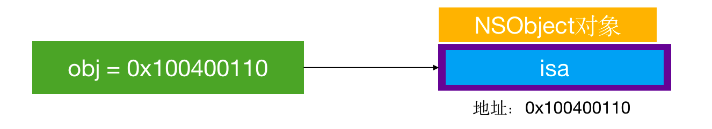
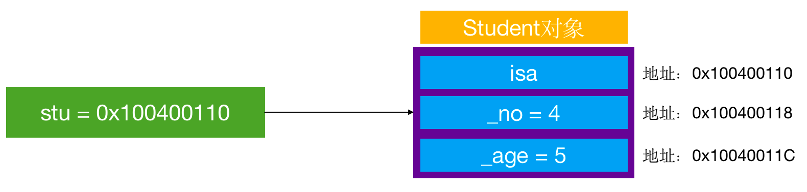
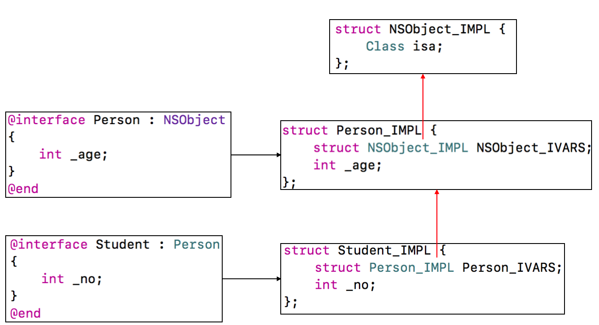
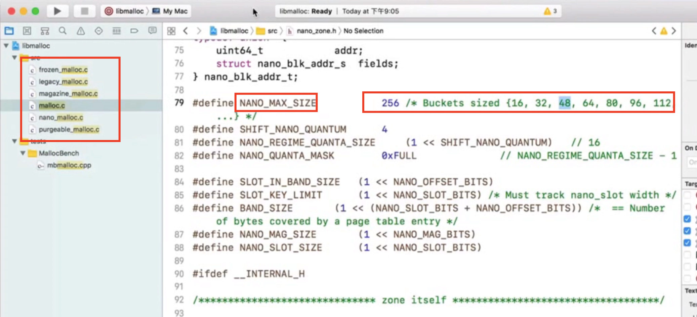
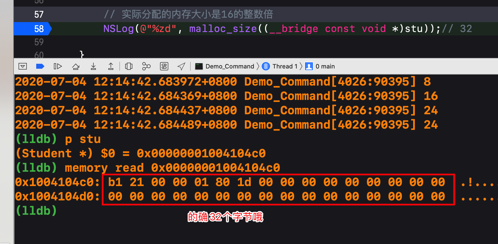
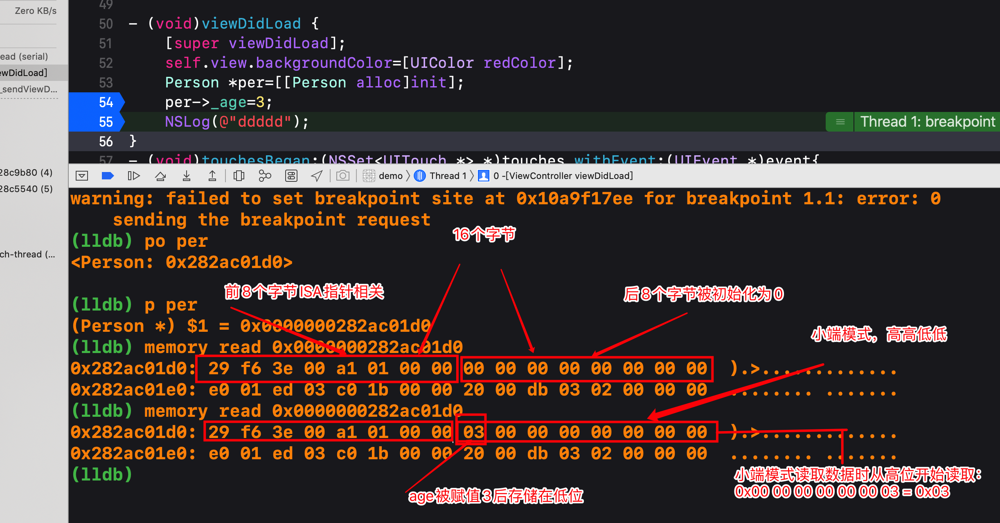
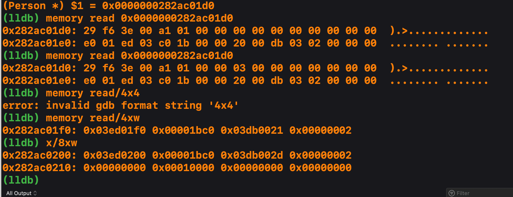

## iOS底层学习笔记
#### 1、NSObject 本质
我们平时编写的Objective-C代码，底层实现其实都是C\C++代码，OC的面向对象也是基于C/C++的结构体struct实现的。

可以使用编译器命令，把OC代码转成C++代码，我们经常的写的“对象”是由C++的结构体实现的。
比如我们创建一个对象：
`NSObject *obj=[[NSObject alloc]init];`
使用下面的命令转成c++代码：
```
//如果需要链接其他框架，使用-framework参数。比如-framework UIKit
xcrun  -sdk  iphoneos  clang  -arch  arm64  -rewrite-objc  OC源文件  -o  输出的CPP文件
```
则NSObject底层实现是：
```
struct NSObject_IMPL {
	Class isa;
};
其中Class是typedef struct objc_class *Class;的定义。
```
那么这个OC对象的内存布局是：


#### 2、自定义对象 Student 的本质
```
@interface Student : NSObject{
    int _name;
    int _age;
}
@end

@implementation Student

@end

Student *stu = [[Student alloc] init];
stu->_name = 4;
stu->_age = 5;
        
```
把以上代码转成c++，可以找到如下的数据结构：
```
struct Student_IMPL {
    struct NSObject_IMPL NSObject_IVARS;
    int _no;
    int _age;
};
而第一个成员变量struct NSObject_IMPL又是下面的定义：
struct NSObject_IMPL {
	Class isa;
};
所以Student对象的底层实现可以写成：
struct Student_IMPL {
    Class isa;
    int _no;
    int _age;
};
```

此时Student对象的内存布局如下：


#### 3、自定义带继承的对象的本质
假如 Student:Person:NSObject
则有如下代码：
```
// Person
@interface Person : NSObject{
    int _age;
}
@property (nonatomic, assign) int height;
@end

@implementation Person

@end

// Student
@interface Student : Person{
    int _no;
}
@end

@implementation Student

@end
```
那么底层实现如下:
```
struct NSObject_IMPL {
    Class isa;
};
struct Person_IMPL {
	struct NSObject_IMPL NSObject_IVARS;
	int _age;
	int _height;
}; // 16 内存对齐：结构体的大小必须是最大成员大小的倍数
struct Student_IMPL {
    struct Person_IMPL Person_IVARS; // 16
    int _no; // 4
}; // 16
```
直观的看如下所示：


#### 4、一个 NSObject 对象占用多少内存

我们可以通过两个函数获取到对象占用内存的大小：
```
创建一个实例对象，至少需要多少内存？
#import <objc/runtime.h>
class_getInstanceSize([NSObject class]);

创建一个实例对象，实际上分配了多少内存？
#import <malloc/malloc.h>
malloc_size((__bridge const void *)obj);
```
那么一个NSObject对象占用多大的内存呢？
```
// Student
@interface Student : NSObject{
    int _no;
}
@property(nonatomic,assign)double age;
@end
@implementation Student
@end

//上面的OC代码对应的底层C++结构体
struct NSObject_IMPL{
    Class *isa;
};
struct Student_IMPL {
    struct NSObject_IMPL NSObject_IVARS; // 8
    int _no; // 4
    double _age; //8
};
```
下面是验证过程：

```
//NSObject
NSObject *obj = [[NSObject alloc] init];
//实例对象的成员变量所占用的大小,并且返回的大小已经是对齐了的。
NSLog(@"%zd", class_getInstanceSize([obj class])); // 8
// 实际分配的内存大小是16的整数倍
NSLog(@"%zd", malloc_size((__bridge const void *)obj));// 16
    
    
//Student
Student *stu = [[Student alloc] init];
//实例对象的成员变量所占用的大小,并且返回的大小已经是对齐了的。
//结构体的内存对其规则：
//是占用最大内存的成员变量的整数倍。
NSLog(@"%zd", class_getInstanceSize([stu class])); // 24
    
//其实也可以用sizeof验证下obj对应的结构体的大小：
NSLog(@"%lu",sizeof(struct Student_IMPL)); // 24

// 实际分配的内存大小是16的整数倍
NSLog(@"%zd", malloc_size((__bridge const void *)stu));// 32
```
* 所以一个NSObject实例对象obj占用多少内存：
    * 系统分配了16个字节给NSObject对象（通过malloc_size函数获得，但NSObject对象内部只使用了8个字节的空间，因为obj只有一个成员变量：Class类型的指针isa。
* 所以一个Student实例对象stu占用多少内存：
    * 系统分配了32个字节给Student实例对象，通过malloc_size函数获得，但Student实例对象内部三个成员变量只使用了20个字节的空间，又因为内存对齐的缘故结系统又给这个结构体多分配了4个字节，也就是最终的24个字节的结构体占用空间。
    * 但事儿还没完，通过查询malloc函数源码，看到iOS系统对分配内存有多重分配方式：其中malloc是通用的方式，nano_malloc是针对较小内存的分配，而且内存分配也不是要多少就给多少，而是使用了叫Buckets sized的一种思想，其实就是一块一块的内存且大小是16的整数倍，为什么是16这应该是苹果的iOS操作系统的深层考虑了，这样对iOS来说CPU访问内存效率会更高。
     

    * 所以针对上面的Student实例对象的实际分配的内存空间问题算是明了了。下面还可以通过LLDB 指令查询下stu的内存分配情况：
    
    

#### 5、常用的 LLDB 指令
* print 或者 p: 打印
* po: 打印对象
* memory read 内存地址：读取改地存储的数据
    * memory read/数量格式字节数: 实现定制化输出
    * memory read/4xb : 分4组，每组1个字节，以十六进制输出.
* 字节大小:
    * b: byte 1字节
    * h：half word 2字节
    * w：word 4字节
    * g：giant word 8字节
* 也可以使用x打印内存相关的：
     * x/4xw: 分4组，每组四个字节，以十六进制输出   





* memory write 内存地址 数值: 修改对应内存中的值
* Xcode可以实时查看内存数据：Debug -> Debug Workfllow -> View Memory（Shift + Command + M）
