## instance对象、class对象、meta-class元类对象
### 1、 instance 实例对象
* instance对象也就是实例对象，通过alloc创建。
* instance对象在内存中存储着信息包括：
	* isa指针
	* 成员变量

### 2、class 类对象

```
//实例对象
NSObject *object1 = [[NSObject alloc] init]; 
NSObject *object2 = [[NSObject alloc] init];
//类对象
Class objectClass1 = [object1 class];
Class objectClass2 = [object2 class];
Class objectClass3 = object_getClass(object1);
Class objectClass4 = object_getClass(object2);
Class objectClass5 = [NSObject class];

//打印实例对象地址
NSLog(@"%p %p",object1,object2);// 0x10044a440 0x10044a250
//打印类对象地址
NSLog(@"\n%p\n %p\n %p\n %p\n %p",objectClass1,objectClass2,objectClass3,objectClass4,
              objectClass5);
//0x7fff92c75118
//0x7fff92c75118
//0x7fff92c75118
//0x7fff92c75118
//0x7fff92c75118

```
* objectClass1 ~ objectClass5都是NSObject的class对象（类对象）
* 它们是同一个对象。**每个类在内存中有且只有一个class对象**
* class对象在内存中存储的信息主要包括:
	* isa指针
	* superclass指针
	* 类的属性信息（@property）、类的对象方法信息（instance method）
	* 类的协议信息（protocol）、类的成员变量信息（ivar)等
	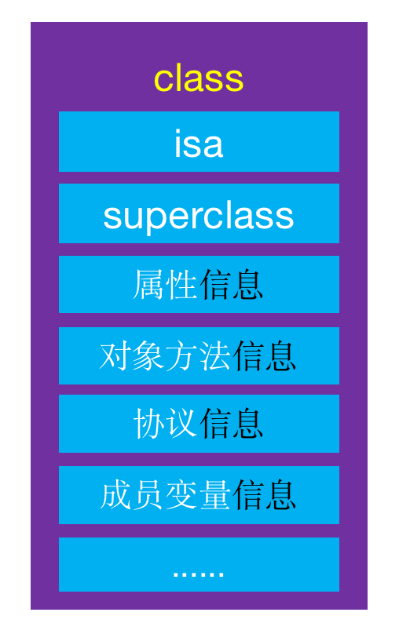
	

	### 3、meta-class 元类对象
	
```
// meta-class对象，元类对象
// 将类对象当做参数传入，获得元类对象
Class objectMetaClass = object_getClass(objectClass5);
```
* objectMetaClass是NSObject的meta-class对象（元类对象）
* **每个类在内存中有且只有一个meta-class对象**
* meta-class对象和class对象的内存结构是一样的，但是用途不一样，在内存中存储的信息主要包括：
	* isa指针
	* superclass指针
	* 类的类方法信息（class method）
	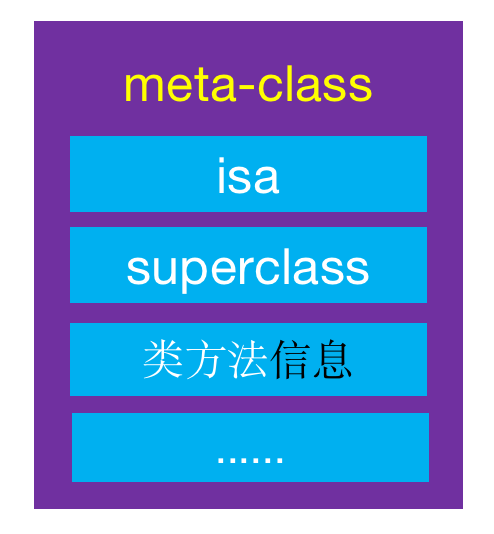
	
	
```
//这个方法可以判断某个对象是不是元类对象
class_isMetaClass() 
```
### 4、isa 指针

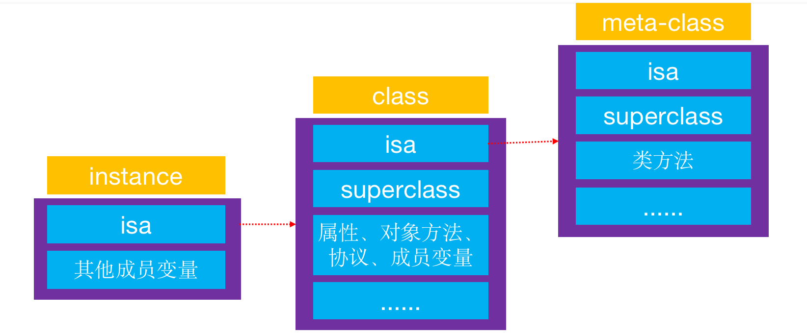

* instance的isa指向class
	* 当调用对象方法时，通过instance的isa找到class，最后找到对象方法的实现进行调用
* class的isa指向meta-class
	* 当调用类方法时，通过class的isa找到meta-class，最后找到类方法的实现进行调用

#### 4.1、isa知识补充
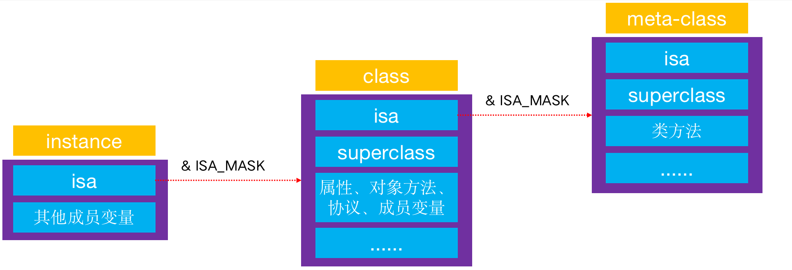

前面讲过了实例对象的isa指向其类对象，在arm64之后实例对象的isa并不是直接指向类对象了，查询源码得知需要进行一次位运算才能得到：
```
# if __arm64__
#   define ISA_MASK        0x0000000ffffffff8ULL
# elif __x86_64__
#   define ISA_MASK        0x00007ffffffffff8ULL
# endif
```
如图所示:
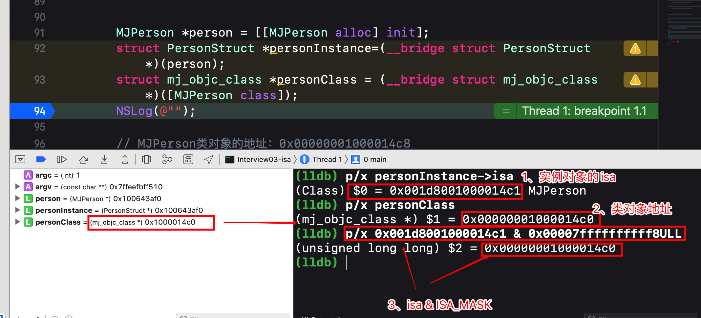
	
### 5、class的superclass指针
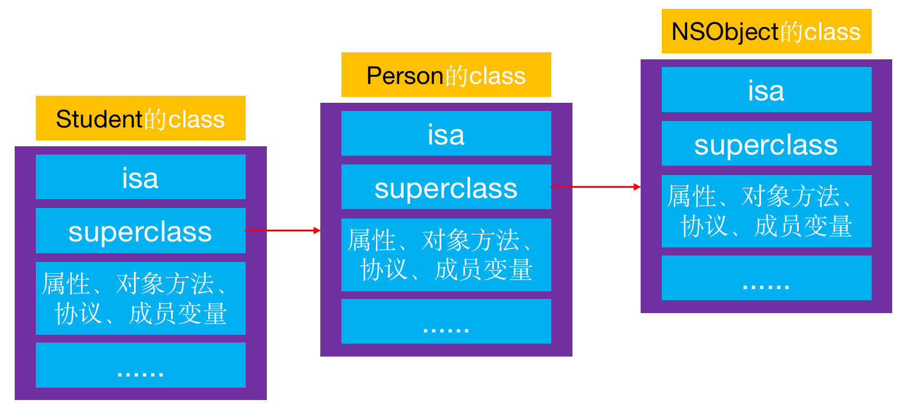

* 当Student的instance对象要调用Person的对象方法时，会先通过isa找到Student的class，然后通过superclass找到Person的class，最后找到对象方法的实现进行调用

#### 5.1、类对象的superclass知识补充
* isa指针需要进行一次位运算才能获取到其真正指向的地址，但类对象的superclass指针不需要进行位运算，是直接指向其父类的类对象的。
* 下面验证：
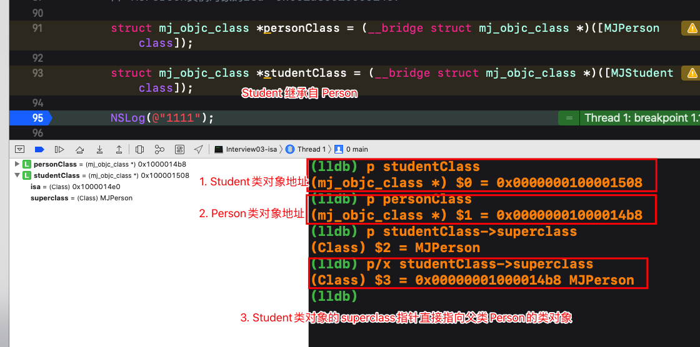

### 6、 meta-class对象的superclass指针
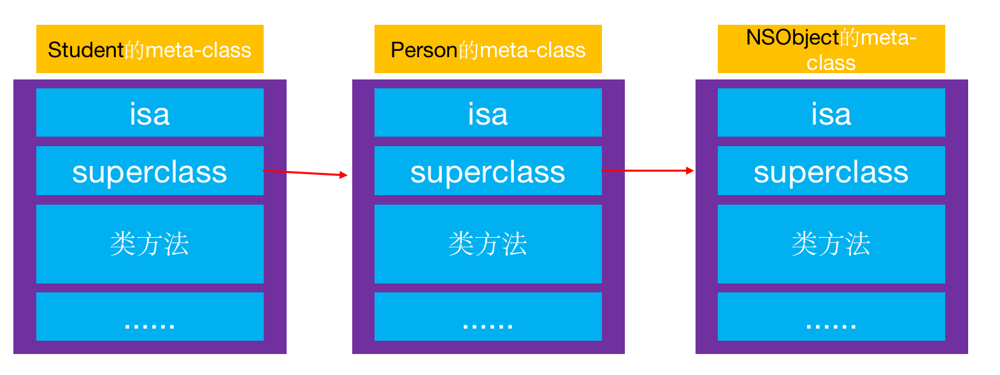

* 当Student的class要调用Person的类方法时，会先通过isa找到Student的meta-class，然后通过superclass找到Person的meta-class，最后找到类方法的实现进行调用

#### 6.1、元类对象的superclass知识补充
* isa指针需要进行一次位运算才能获取到其真正指向的地址，但元类对象的superclass指针不需要进行位运算，是直接指向其父类的元类对象的。
如下：
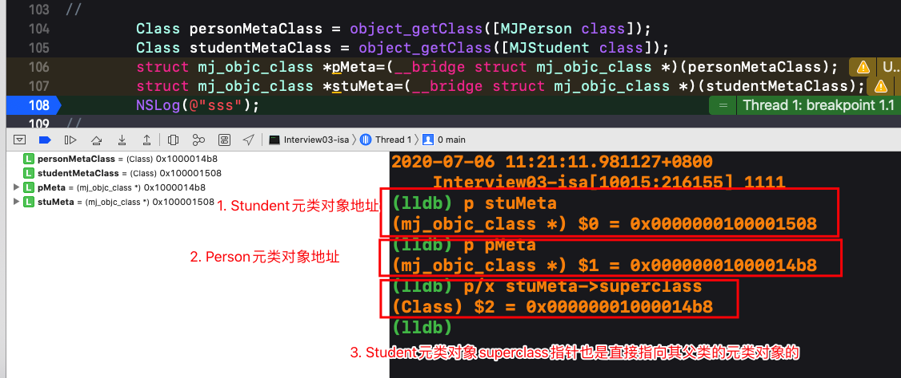

### 7、isa 和 superclass的总结
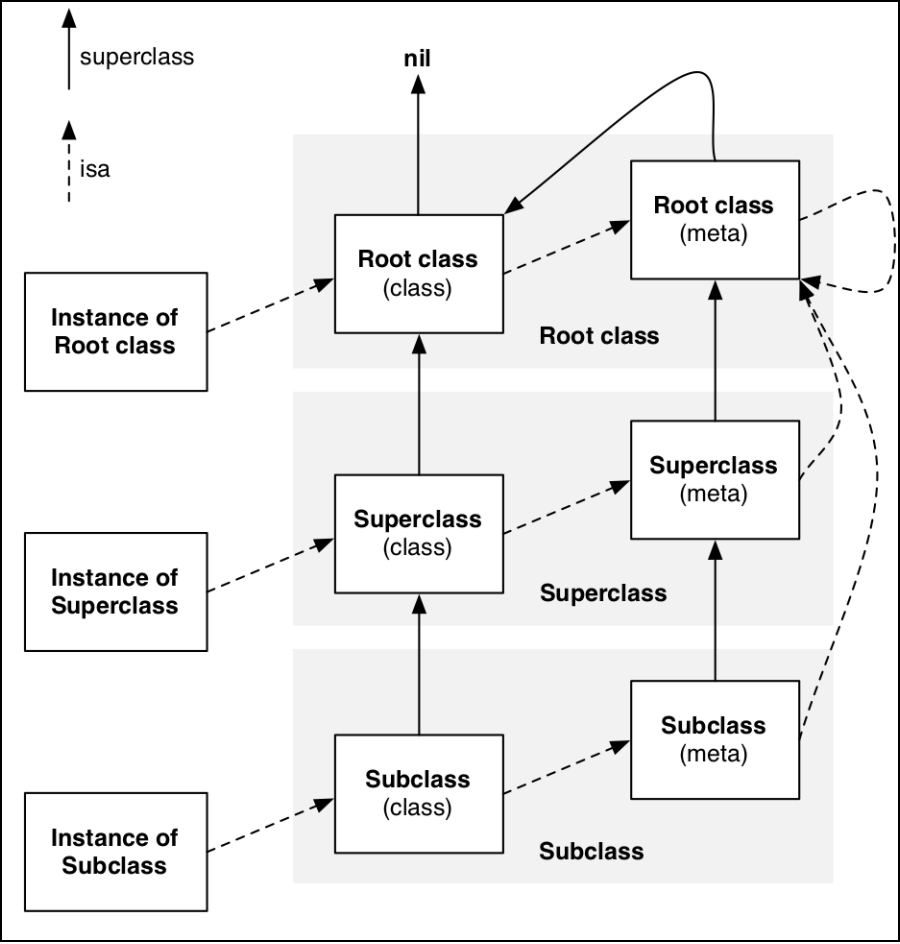

* instance的isa指向class
* class的isa指向meta-class
* meta-class的isa指向基类的meta-class
* class的superclass指向父类的class
	* 如果没有父类，superclass指针为nil
* meta-class的superclass指向父类的meta-class
	* 基类的meta-class的superclass指向基类的class
* instance调用对象方法的轨迹
	* isa找到class，方法不存在，就通过superclass找父类
* class调用类方法的轨迹
	* isa找meta-class，方法不存在，就通过superclass找父类

### 8、窥探 struct objc_class 结构
* [跳转下载objc源码](https://opensource.apple.com/tarballs/objc4/
)
* class、meta-class对象的本质结构都是struct objc_class
* 在源码中查到以下源码，但这个已经被弃用了，目前OC语法已经是第四个版本了，下面的是objc2的版本

```
struct objc_class {
    Class _Nonnull isa  OBJC_ISA_AVAILABILITY;

#if !__OBJC2__
    Class _Nullable super_class                              OBJC2_UNAVAILABLE;
    const char * _Nonnull name                               OBJC2_UNAVAILABLE;
    long version                                             OBJC2_UNAVAILABLE;
    long info                                                OBJC2_UNAVAILABLE;
    long instance_size                                       OBJC2_UNAVAILABLE;
    struct objc_ivar_list * _Nullable ivars                  OBJC2_UNAVAILABLE;
    struct objc_method_list * _Nullable * _Nullable methodLists                    OBJC2_UNAVAILABLE;
    struct objc_cache * _Nonnull cache                       OBJC2_UNAVAILABLE;
    struct objc_protocol_list * _Nullable protocols          OBJC2_UNAVAILABLE;
#endif

} OBJC2_UNAVAILABLE;
/* Use `Class` instead of `struct objc_class *` */
```
* 所以objc4的struct objc_class如下所示：

```
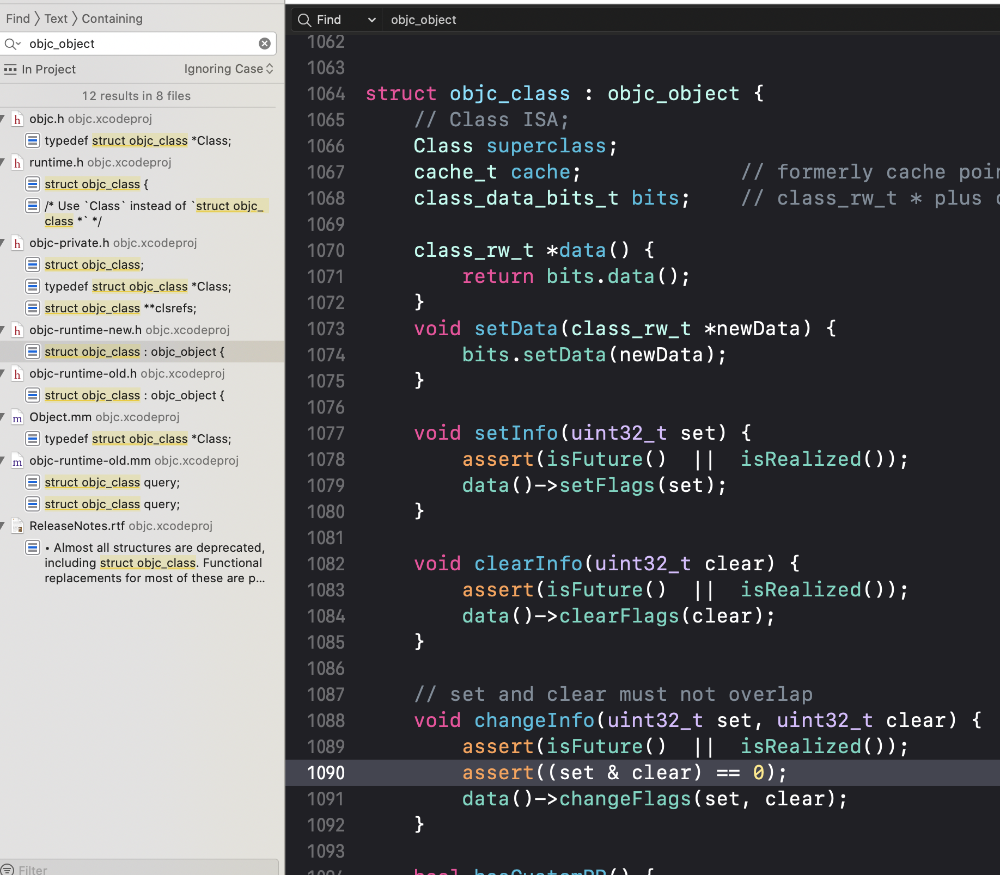
```
* objc4的objc_class和objc2的已经大不一样了，方法缓存列表、方法列表、成员变量信息等数据已经分散在不同的结构体中，MJ老师已经将其抽离出来了。如下结构所示
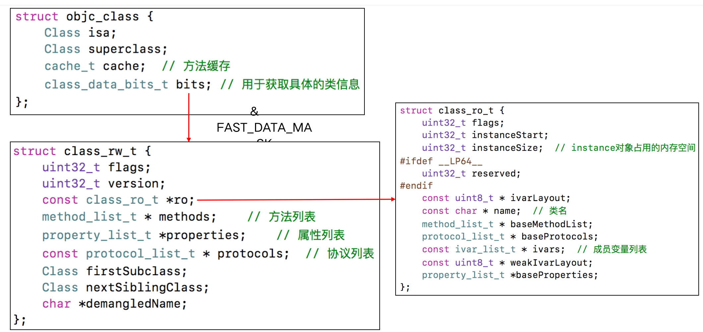

待续。。。

