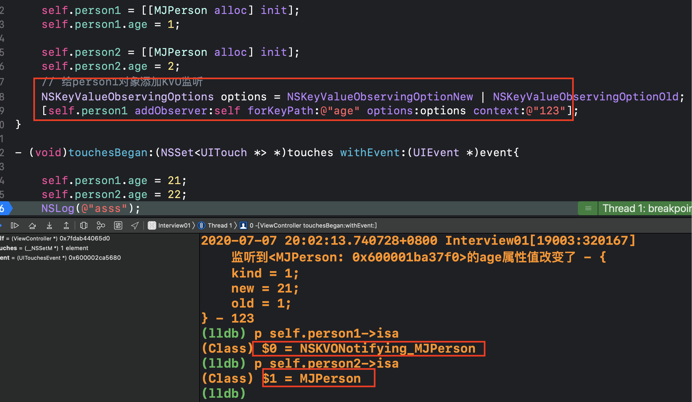
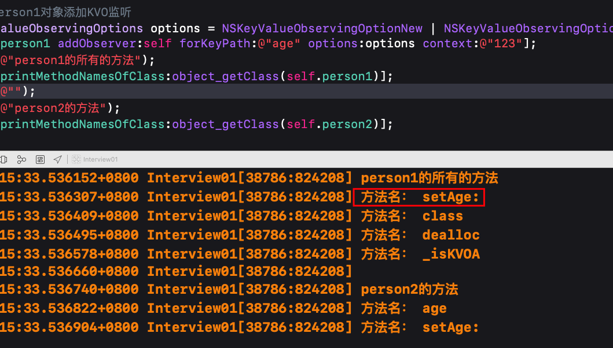
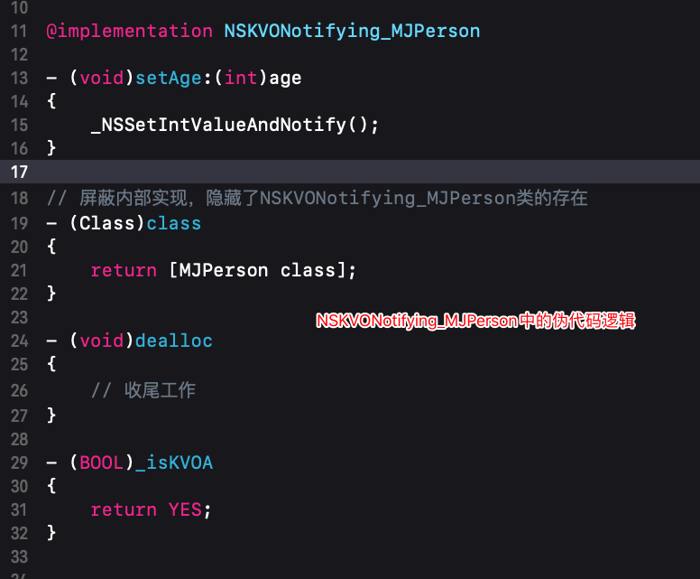
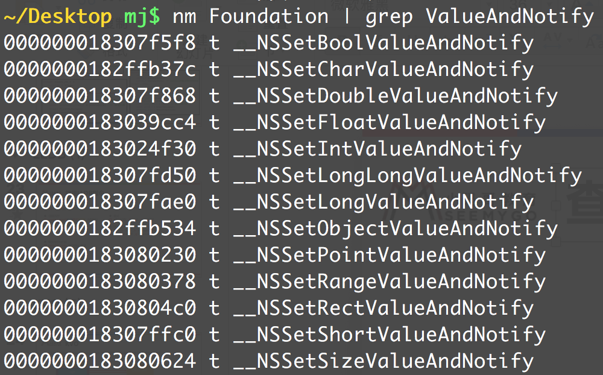
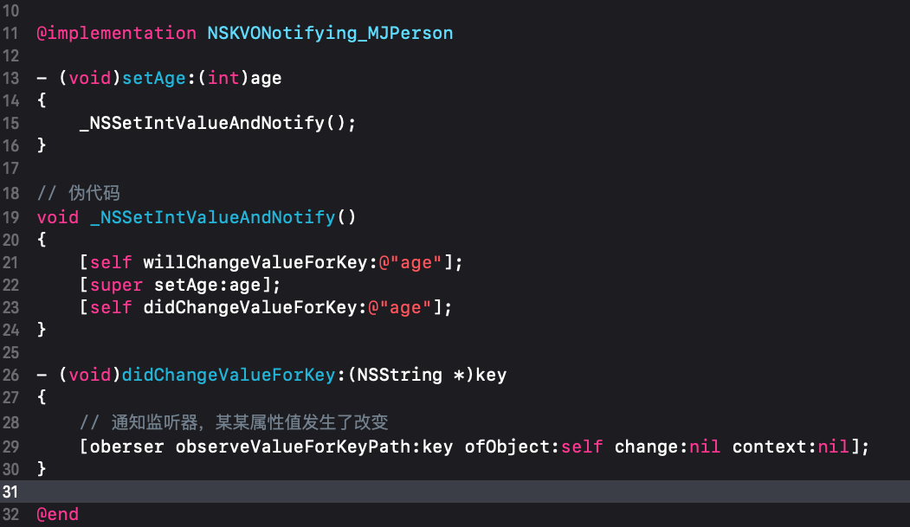
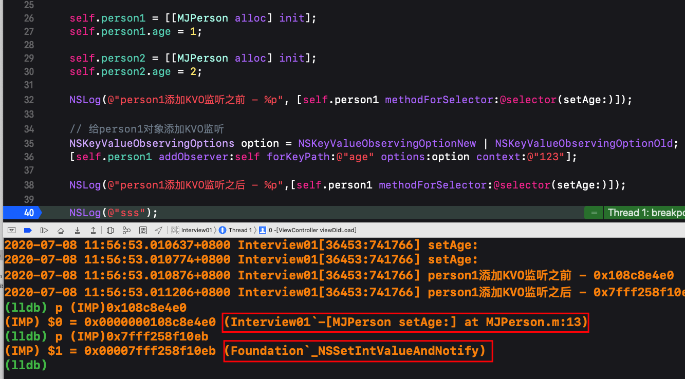
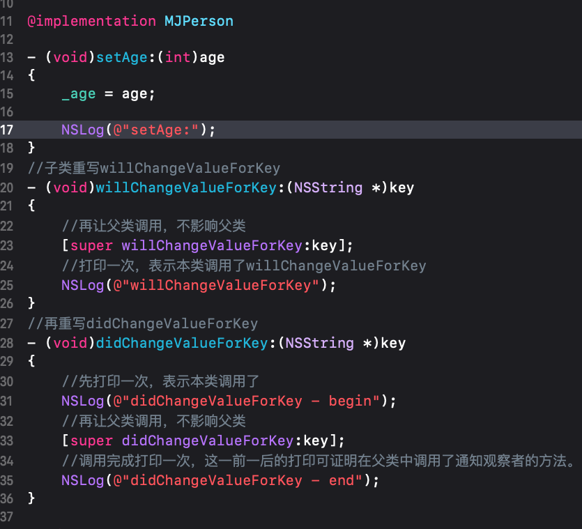
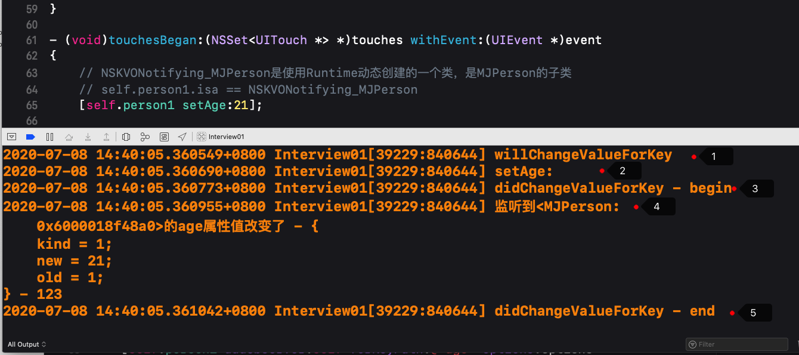
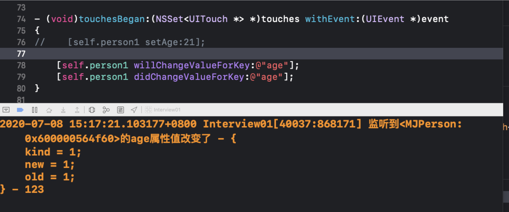

## KVO(Key-Value Observing)键值监听
### KVO大致原理
* 添加观察者时runtime动态生成了一个NSKVONotifying_XXX类
* NSKVONotifying_XXX类是重写了属性的setter方法
* 在setter方法中调用了Founddation框架中的_NSSetIntValueAndNotify() C 方法
* _NSSetIntValueAndNotify()方法中先调用willChangeValueForKey方法
* 然后调用super的setter方法
* 最后调用didChangeValueForKey
* didChangeValueForKey方法中调用observeValueForKeyPath:ofObject:change:context方法，即完成通知

### 原理验证
#### 动态类NSKVONotifying_XXX
* 添加观察者时runtime动态生成了一个NSKVONotifying_XXX类
    *  添加观察者后person1的类对象本应该是MJPerson，但实际打印出来变成了NSKVONotifying_MJPerson
    *  person2没有添加观察者所以其类对象仍然是MJPerson
    
    
    
#### 动态类重写setAge：方法
* NSKVONotifying_MJPerson类是重写了属性的setter方法
下面是利用runtime打印NSKVONotifying_MJPerson中存储的所有方法

```
- (void)printMethodNamesOfClass:(Class)cls{
    unsigned int count;
    // 获得方法数组
    Method *methodList = class_copyMethodList(cls, &count);
    // 存储方法名
    NSMutableString *methodNames = [NSMutableString string];
    // 遍历所有的方法
    for (int i = 0; i < count; i++) {
        // 获得方法
        Method method = methodList[i];
        // 获得方法名
        NSString *methodName = NSStringFromSelector(method_getName(method));
        // 拼接方法名
        [methodNames appendString:methodName];
        [methodNames appendString:@", "];
    }
    // 释放
    free(methodList);
    // 打印方法名
    NSLog(@"%@ %@", cls, methodNames);
}

```

打印结果如下：



且NSKVONotifying_MJPerson中的伪代码逻辑如下所示：



* 在setAge：方法中又调用了Foundation框架中的一个方法
* 它还重写了class方法，但通过代码[self.person1 class]得到的仍然是MJPerson
    * 所以大致判断重写的class方法内部实现是：[MJPerson class]
    * 之所以不返回NSKVONotifying_MJPerson就是为了屏蔽用户
    * 不让用户知道添加KVO观察者后系统会动态生成一个类NSKVONotifying_XXX
* dealloc方法中做收尾工作，销毁动态类等
* 一个专有方法_isKVO

#### 调用Founddation框架
* 在setAge:方法中调用了Founddation框架中的_NSSetIntValueAndNotify() C 方法
* 如何验证Foundation框架中真的有这个方法呢？
    * 需要用到逆向的知识，把Foundation框架反编译出来
    * 再利用逆向/破解软件读取Foundation中的所有的方法。。
    * 这个东西。。。。我还没掌握，待续。。。。😀 
* 其实不止有_NSSetIntValueAndNotify方法，还有Double、float、bool等


#### _NSSetIntValueAndNotify
* _NSSetIntValueAndNotify方法中的大致逻辑如下：


* 下面可简单验证_NSSetIntValueAndNotify方法中调用了setAge：
    * 分别打印出setAge方法在何处调用的
        * person2也就是没有添加观察者，该方法就写在自己的实现的类文件中
        * person1也就是添加了观察者，该方法最终在Foundation中的_NSSetIntValueAndNotify方法中


* 下面验证_NSSetIntValueAndNotify方法中的其他逻辑：

看下面的的打印结果：

1. 先打印willChangeValueForKey表示先调用了重写的该方法
2. 之后调用了setAge：修改值。
3. begin打印，先于父类调用，然后父类再调用didChangeValueForKey
4. 紧着就收到了通知，表明在父类再调用didChangeValueForKey通知了观察者
5. 之后本类的end打印。完成。

### 总结
* iOS用什么方式实现对一个对象的KVO？(KVO的本质是什么？)
    * 利用RuntimeAPI动态生成一个子类，并且让instance对象的isa指向这个全新的子类
    * 当修改instance对象的属性时，会调用Foundation的_NSSetXXXValueAndNotify
        * willChangeValueForKey:
        * 父类原来的setter
        * didChangeValueForKey:
        * 内部会触发监听器（Oberser）的监听方法( observeValueForKeyPath:ofObject:change:context:）
* 如何手动触发KVO？
    * 手动调用willChangeValueForKey:和didChangeValueForKey:，如下代码所示
```
- (void)touchesBegan:(NSSet<UITouch *> *)touches withEvent:(UIEvent *)event{
//    [self.person1 setAge:21];//注释掉
    //添加下面两行代码
    //理解了上面原理，就应该能理解为何单单下面两句就能触发KVO了。
    [self.person1 willChangeValueForKey:@"age"];
    [self.person1 didChangeValueForKey:@"age"];
}
```

* 直接修改成员变量会触发KVO吗？
* 不会

