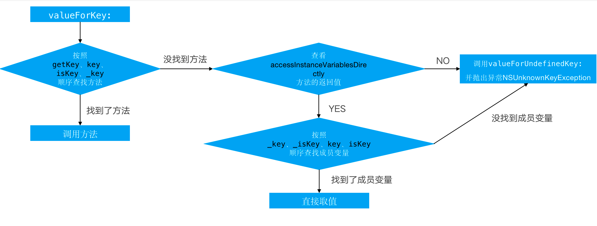

## KVC (Key-Value Coding) 键值编码
### 通过KVC修改属性会触发KVO么？
会。如下：


* 当age是属性时，那么系统系统自动生成该属性的setter方法，KVC赋值就会调用setter方法，调用了setter方法，自然就会触发KVO
* 当age是成员变量时，没有setter方法，也会触发KVO。当使用KVC赋值时其原理相当于手动触发KVO，原理如下：

```
//调用即将改变
[person willChangeValueForKey:@"age"];
//给成员变量直接赋值
person->_age = 10; 
//调用已经改变
[person didChangeValueForKey:@"age"];
```

### KVC的赋值和取值过程是怎样的？
#### 赋值


1. KVC赋值时先找 **setKey:** 方法， 找到就调用该方法，传递参数，进行赋值；
2. 没有找到 **setKey:** 就会找 **_setKey:** 方法，找到就调用该方法，传递参数，进行赋值；
3. 如果 **setKey:** 和 **_setKey:** 方法都没有找到，则调用 **accessInstanceVariablesDirectly** 方法，查询是否能够直接访问成员变量；
4. 若能访问成员变量，则先找 **_key** 成员变量，找到则直接赋值；
5. 若 **_key** 成员变量没找到，则查询 **_isKey**, 找到则直接赋值；
6. 若 **_isKey** 成员变量没找到，则查询 **key**, 找到则直接赋值；
7. 若 **key** 成员变量没找到，则查询 **isKey**, 找到则直接赋值；
8. 若最后查询的成员变量 **isKey** 都没找到，则报错崩溃：**NSUnknownKeyException**
9. 若不能访问成员变量，则直接报错崩溃：**NSUnknownKeyException**


#### 取值


1. KVC取值时先找 **getKey** 方法， 找到就调用该方法取值；
2. 若没有找到 **getKey** 方法，则查询 **key** 方法，找到就调用该方法取值；
3. 若没有找到 **key** 方法，则查询 **isKey** 方法，找到就调用该方法取值；
4. 若没有找到 **isKey** 方法，则查询 **_key** 方法，找到就调用该方法取值；
5. 若四个方法都没有找到，则调用 **accessInstanceVariablesDirectly** 方法，查询是否能够直接访问成员变量；
6. 若能访问成员变量，则先找 **_key** 成员变量，找到则直接取值；
7. 若 **_key** 成员变量没找到，则查询 **_isKey**, 找到则直接取值；
8. 若 **_isKey** 成员变量没找到，则查询 **key**, 找到则直接取值；
9. 若 **key** 成员变量没找到，则查询 **isKey**, 找到则直接取值；
10. 若最后查询的成员变量 **isKey** 都没找到，则报错崩溃：**NSUnknownKeyException**
11. 若不能访问成员变量，则直接报错崩溃：**NSUnknownKeyException**