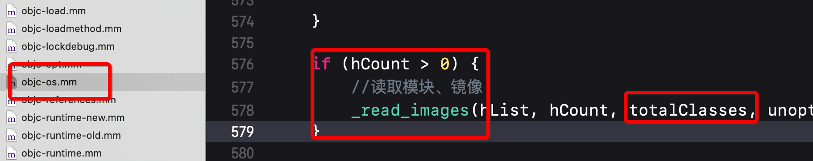

## Category
### Category的底层结构
#### 底层结构
查看Objc源码，category定义在objc-runtime-new.h中。如下


#### 分类编译后的结构
创建如下分类：

每个分类的.h和.m如下：
Test分类：


Eat分类：


使用`xcrun -sdk iphoneos clang -arch arm64 -rewrite-objc Person+Eat.m`命令对该分类文件进行编译，得到一个传cpp文件，就是编译后的代码，其中可以看到有个_category_t结构体：


编译后eat分类中的对应代码生成如下：
* 实例方法列表

* 类方法列表
 
* 属性列表

* 同样还有遵守的协议不再继续添加图片。

**总结** 所以分类在编译后，会生成每个分类对应的category的结构体，方法、属性等都存在结构体中
### Category的加载处理过程
#### 分类方法调用 
* 如果分类中实现了本类中的一个方法，在调用时是什么现象？


**原因：** 通过结构看到值打印了分类test里面的实现，而分类Eat和本来里面的实现没有打印。只打印分类Test的实现不打印分类Eat的实现，是因为编译顺序的问题，分类Test在分类Eat之后编译，最终运行时Test的方法列表在一个大数组前面；不打印本类是因为本类的方法在运行时就被安排到了方法大数组的最后面。只要找到一个对应的方法名，即调用。

#### 源码分析分类数据加载过程

* objc-os.mm 这是运行时的入口
	* _objc_init 运行时初始化
	* map_images 所有模块或镜像
	* map_images_nolock 解锁所有模块或镜像


* objc-runtime-new.mm
	* _read_images
	* remethodizeClass
	* attachCategories
	* attachLists
	* realloc、memmove、 memcpy



```
//cls  : 类
//cats : 该类对应的所有的分类，是个分类列表
static void attachCategories(Class cls, category_list *cats, bool flush_caches){
    if (!cats) return;
    if (PrintReplacedMethods) printReplacements(cls, cats);
    bool isMeta = cls->isMetaClass();
    // fixme rearrange to remove these intermediate allocations
    // 方法列表 二维数组 [[method_t, method_t], [method_t, method_t]]
    method_list_t **mlists = (method_list_t **)
        malloc(cats->count * sizeof(*mlists));
    // 属性列表
    property_list_t **proplists = (property_list_t **)
        malloc(cats->count * sizeof(*proplists));
    // 协议列表
    protocol_list_t **protolists = (protocol_list_t **)
        malloc(cats->count * sizeof(*protolists));

    // Count backwards through cats to get newest categories first
    int mcount = 0;
    int propcount = 0;
    int protocount = 0;
    int i = cats->count;
    bool fromBundle = NO;
    while (i--) { // i-- 从后向前遍历
        auto& entry = cats->list[i];// 取出分类

        //取出分类方法列表
        method_list_t *mlist = entry.cat->methodsForMeta(isMeta);
        if (mlist) {
            //把该分类的方法列表放入前面定义的大数组mlists中。
            //mcount++ 是从0开始
            mlists[mcount++] = mlist;
            fromBundle |= entry.hi->isBundle();
        }
        property_list_t *proplist = 
            entry.cat->propertiesForMeta(isMeta, entry.hi);
        if (proplist) {
            proplists[propcount++] = proplist;
        }
        protocol_list_t *protolist = entry.cat->protocols;
        if (protolist) {
            protolists[protocount++] = protolist;
        }
    }
    // rw 是objc_class结构体中用来拿到类对象方法列表的一个数据结构
    // 这是取出类对象中的数据
    auto rw = cls->data();

    prepareMethodLists(cls, mlists, mcount, NO, fromBundle);
    //将所有分类的对象方法附加到类对象的方法列表中
    rw->methods.attachLists(mlists, mcount);
    free(mlists);
    if (flush_caches  &&  mcount > 0) flushCaches(cls);
    
    ////将所有分类的属性方法附加到类对象的属性列表中
    rw->properties.attachLists(proplists, propcount);
    free(proplists);
    
    //将所有分类的协议附加到类对象的协议
    rw->protocols.attachLists(protolists, protocount);
    free(protolists);
}
```

```
void attachLists(List* const * addedLists, uint32_t addedCount) {
        if (addedCount == 0) return;

        if (hasArray()) {
            // many lists -> many lists
            uint32_t oldCount = array()->count;
            //数量增加分类的数量
            uint32_t newCount = oldCount + addedCount;
            //realloc重新初始化内存大小newCount
            setArray((array_t *)realloc(array(), array_t::byteSize(newCount)));
            array()->count = newCount;
            
            //array()已经扩大内存了
            //memmove是把array()->lists本类方法列表在大数组中往后移动addedCount个位置。
            //addedCount就是本类拥有的分类个数，也就是本类所有分类的方法列表个数
            memmove(array()->lists + addedCount, array()->lists, 
                    oldCount * sizeof(array()->lists[0]));
            //把分类的方法列表addedLists移动到array()->lists数组的最前面
            //本类自己的方法列表放在了最后面
            //所以假如本类和分类都含有同名的方法，在运行时遍历到一个大数组中的第一个分类方法列表时
            //如果找到该方法就直接调用了。
            //而分类间的同名方法调用顺序则就完全依赖分类在大数组中的前后顺序了
            //分类的前后顺序也就是编译顺序，XCode能控制。工程 -> BUild Phases -> Compile Source
            //最后编译的最终会放到大数组的最前面
            memcpy(array()->lists, addedLists, 
                   addedCount * sizeof(array()->lists[0]));
        }
        else if (!list  &&  addedCount == 1) {
            // 0 lists -> 1 list
            list = addedLists[0];
        } 
        else {
            // 1 list -> many lists
            List* oldList = list;
            uint32_t oldCount = oldList ? 1 : 0;
            uint32_t newCount = oldCount + addedCount;
            setArray((array_t *)malloc(array_t::byteSize(newCount)));
            array()->count = newCount;
            if (oldList) array()->lists[addedCount] = oldList;
            memcpy(array()->lists, addedLists, 
                   addedCount * sizeof(array()->lists[0]));
        }
    }
```
形象些如下：


* 原理如下：
    * 程序运行时通过Runtime加载某个类的所有Category数据
    * 把所有Category的方法、属性、协议数据，合并到一个大数组中，后参与编译的Category数据，会在数组的前面。
    * 将合并后的分类数据（方法、属性、协议），插入到类原来数据的前面。

### Category和Extension
* Category
    * Category编译之后的底层结构是struct category_t，里面存储着分类的对象方法、类方法、属性、协议信息
    * 在程序运行的时候，runtime会将Category的数据，合并到类信息中（类对象、元类对象中）
*  Extension
    * Extension在编译的时候，它的数据就已经包含在类信息中
    * Category是在运行时，才会将数据合并到类信息中
    
### Load 方法    
#### load方法调用顺序
**前提**
* 示例中Son继承自Person，Person有两个分类Test和Eat；
* 每个类中都有一个类方法load
看下面打印：


**结果：** 在没有import的情况下、没有调用的情况下，程序跑起来变打印出了load方法。且有如下调用顺序：
* 先调用父类的load （不同想干的类之间按照编译顺序调用，先编译则先调用）
* 再调用子类的load
* 按照编译顺序调用分类的load

**疑问** 
* 根本还没有调用load方法，为什么就打印出来了？
* 按照前面一节的知识来讲，当分类中存在与本类相同的方法时，调用的时候也会只调用分类的方法，为什么load方法无论分类还是本类都被调用了呢？ 

**解答**
* +load方法会在运行时加载类、分类时自动被调用；每个类、分类的+load，在程序运行过程中只调用一次，且调用顺序和编译顺序有关。
* 比如上节讲的run方法在分类和本类中和都有，但调用的确是分类中的run。
    * 是因为**[person run ]**这种形式的本质是runtime的发消息机制：**objc_msgSend**；
    * 涉及到消息发送，就会按照isa指针找类对象或者元类对象中的对象方法或类方法调用，如果某个类恰巧存在分类则该分类中的那个方法就被调用了；
    * 而load方法调用机制不同：load方法在运行时加载所有类时，会直接拿到每个类中的load方法地址，直接调用执行，没有涉及到消息发送机制，也就不会按照isa机制来查找方法。

#### load调用源码分析
源码解读：
* objc-os.mm
    * _objc_init 运行时加载类、分类
* objc-runtime-new.mm
    * load_images
    * prepare_load_methods 准备工作
        * schedule_class_load 定制规划类的顺序问题
        * objc-loadmethod.mm
            * add_class_to_loadable_list 添加类到数组中
            * add_category_to_loadable_list 添加分类到数组中
    * objc-loadmethod.mm
        * call_load_methods 依次调用数组中所有类的load方法
            * call_class_loads 调用类的load方法
            * call_category_loads  调用分类的load方法
            * (*load_method)(cls, SEL_load) 函数指针直接调用方法
             
下面分部看：

* _objc_init 运行时加载类、分类

* load_images
 
* prepare_load_methods 准备工作

    * schedule_class_load 定制规划类的顺序问题
    
    * add_class_to_loadable_list 添加类到数组中
    
    * add_category_to_loadable_list 添加分类到数组中
     
* call_load_methods 依次调用数组中所有类的load方法

    * call_class_loads 调用类的load方法
    
    * call_category_loads  调用分类的load方法
    
    * (*load_method)(cls, SEL_load) 函数指针直接调用方法
    
        
        

