2020年9月25 北京  天气凉爽

来研究下常用的block吧
***
### Block本质
* block本质上也是一个OC对象，它内部也有个isa指针
* block是封装了函数调用以及函数调用环境的OC对象
* block的底层结构如右图所示

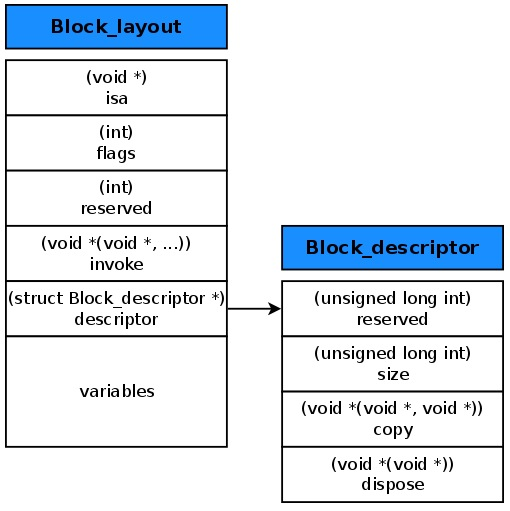
***
把下面的block代码用命令进行clang编译成cpp代码：
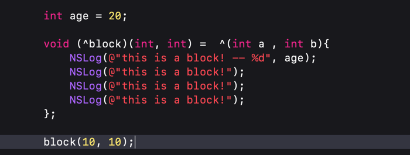
编译后的代码如下
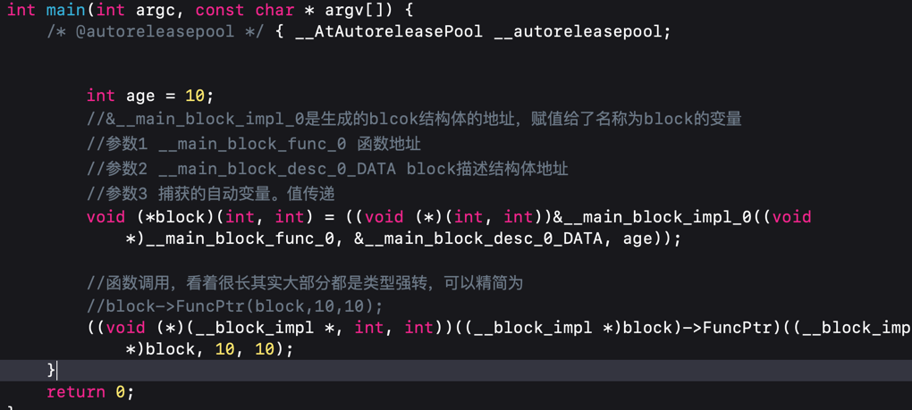

 其中__main_block_impl_0的结构如下：
 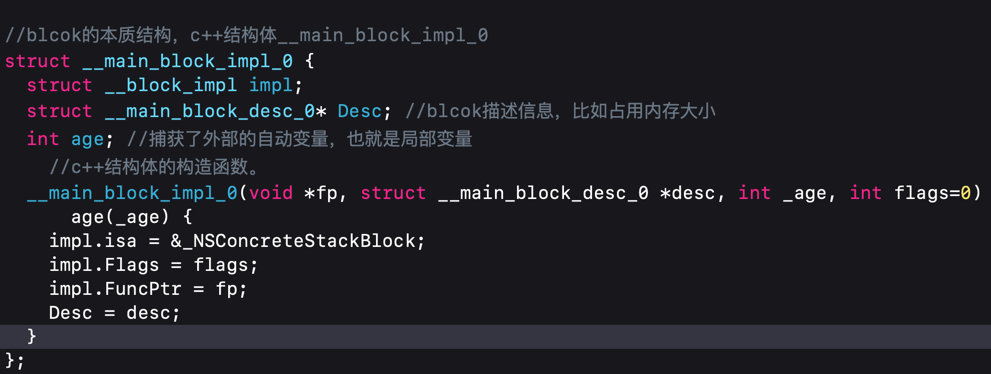

这是oc block的本质，是一个c++的结构体 

***

其中第一个成员impl结构体如下：
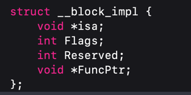
  可以看到有个ISA指针，所以blcok本质就是一个oc对象，后面会通过这个isa指针把它的父类一级一级的都薅出来。
  
***

__main_block_impl_0的第二个成员是个指针，desc是对__main_block_impl_0结构体的一个描述信息：
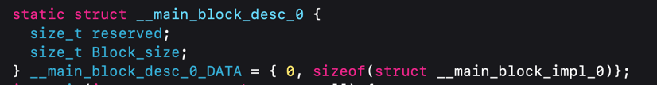

***

__main_block_impl_0的第3个成员是从外部捕获的一个外部变量。

int age = 10; 其实就是 auto int age = 10; 这是个自动变量，且定义在函数内部，是个局部变量，是值传递。

如果是static int age = 10; 即便这个变量定义在函数体内，虽也是局部变量，但是不会释放的。这中变量也会捕获。但是指针传递。

如果是全局变量，block就不会捕获外部变量，因为是全局的，在哪里都能访问到，不需要捕获这个值进来。

所以为了保证block内部能够正常访问外部的变量，block有个变量捕获机制
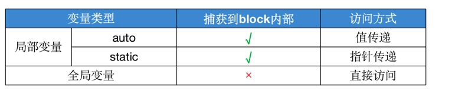

***

再往下就是__main_block_impl_0结构体的构造函数，其中第一个参数就是oc block块里要执行的代码被封装成了函数的指针：
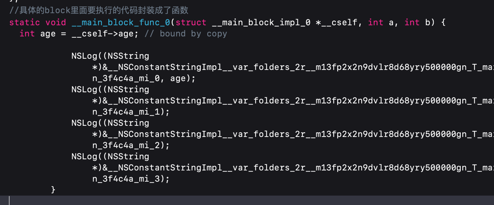

***

因为__main_block_impl_0结构体的第一个成员不是指针仅仅是一个__block_impl结构体变量，其实可以直接替换成如下： 
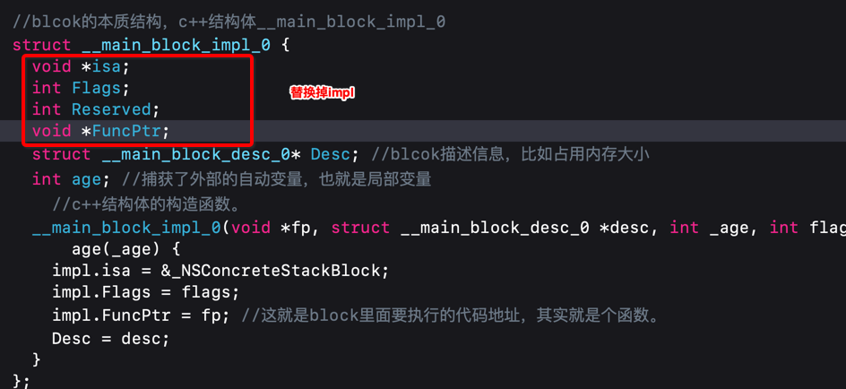

这样来看大致就是开头的的第一张图的结构了。

### block的类型
* 通过调用class方法或者isa指针查看具体类型

如图所示
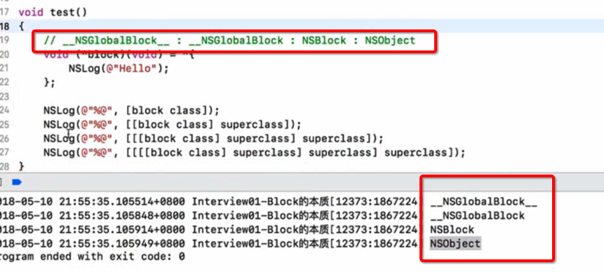

可以看到又这么一种继承关系：__NSGlobalBlock__ : __NSGlobalBlock : NSBlock : NSObject

***

* block 有三种类型
    * __NSGlobalBlock__ （ _NSConcreteGlobalBlock ）
    * __NSStackBlock__ （ _NSConcreteStackBlock ）
    * __NSMallocBlock__ （ _NSConcreteMallocBlock ）

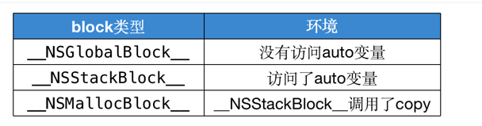
#### __NSGlobalBlock__
没有访问auto 变量就是global block 
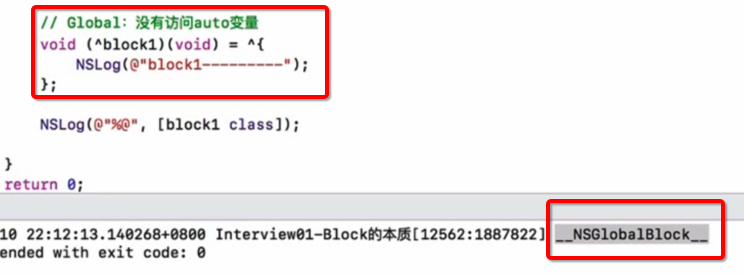
#### __NSStackBlock__
访问了auto 变量。这个需要再 MRC 环境下才能看到，因为ARC自动做了copy操作
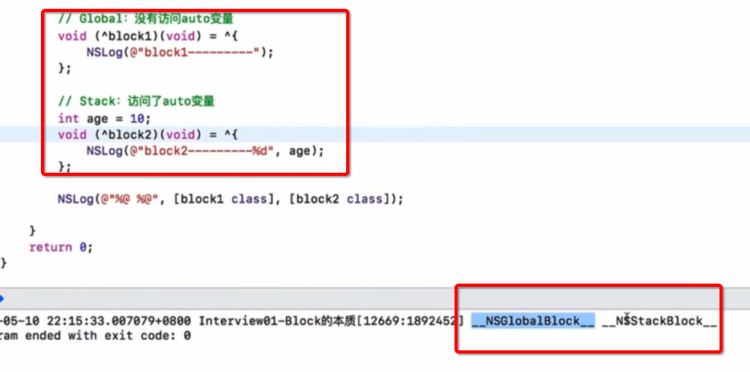

当一个函数中有block时，且访问了外部局部变量，那么这是个stack block, 执行了函数后但还没执行里面的block，如果此时再执行blcok 就会发火说呢过数据错乱的情况，因为函数里面的变量都释放了，此时再访问里面的局部变量就是你错误的。比如下面：
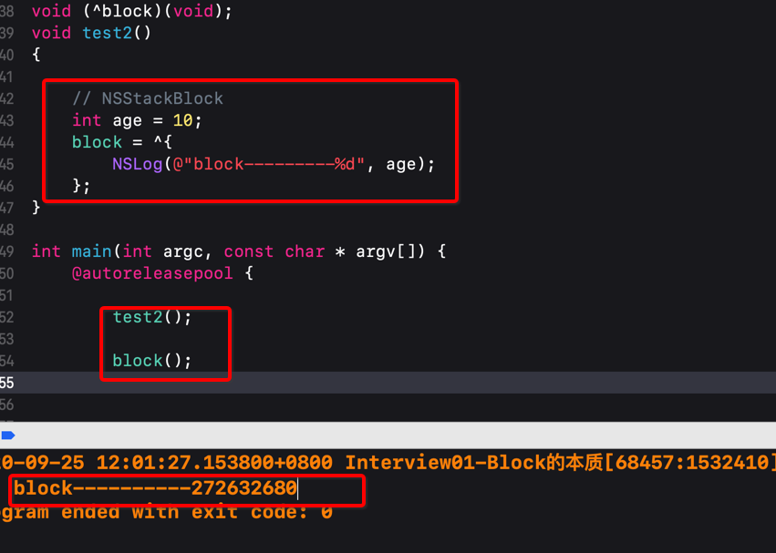
可以看到打印数据错乱了

但是如果对这个stack blcok 进行一次copy操作，它就升级了，成为了堆 block。
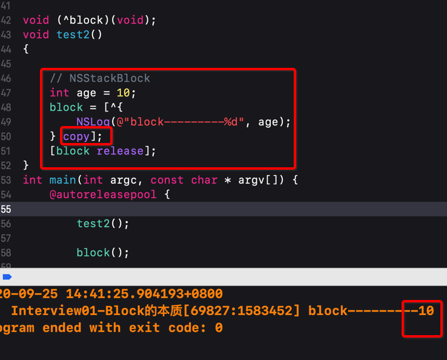

#### __NSMallocBlock__
__NSStackBlock__ 调用了copy操作后就会变为堆block。
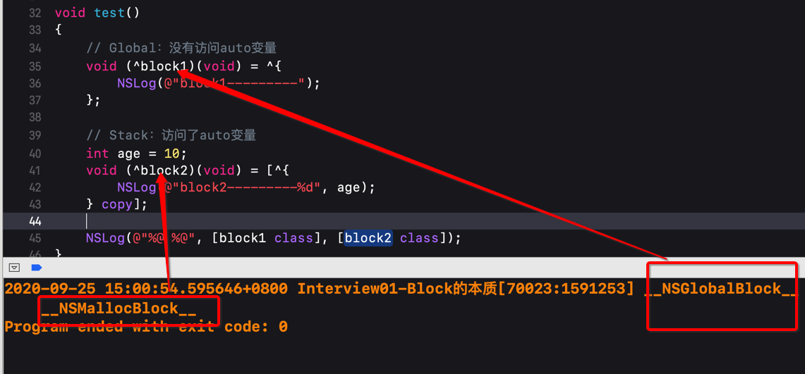

**备注**
* 每一种类型的block调用copy后的结果如下所示

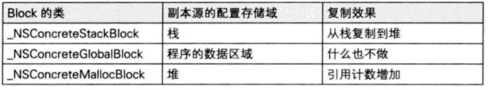

