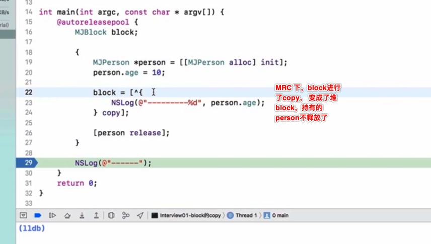

2020年9月25 北京  天气凉爽

来研究下常用的block吧
***
### Block本质
* block本质上也是一个OC对象，它内部也有个isa指针
* block是封装了函数调用以及函数调用环境的OC对象
* block的底层结构如右图所示

***
把下面的block代码用命令进行clang编译成cpp代码：

编译后的代码如下

 其中__main_block_impl_0的结构如下：
 

这是oc block的本质，是一个c++的结构体 

***

其中第一个成员impl结构体如下：

  可以看到有个ISA指针，所以blcok本质就是一个oc对象，后面会通过这个isa指针把它的父类一级一级的都薅出来。
  
***

__main_block_impl_0的第二个成员是个指针，desc是对__main_block_impl_0结构体的一个描述信息：

***

__main_block_impl_0的第3个成员是从外部捕获的一个外部变量。

int age = 10; 其实就是 auto int age = 10; 这是个自动变量，且定义在函数内部，是个局部变量，是值传递。

如果是static int age = 10; 即便这个变量定义在函数体内，虽也是局部变量，但是不会释放的。这中变量也会捕获。但是指针传递。

如果是全局变量，block就不会捕获外部变量，因为是全局的，在哪里都能访问到，不需要捕获这个值进来。

所以为了保证block内部能够正常访问外部的变量，block有个变量捕获机制

***

再往下就是__main_block_impl_0结构体的构造函数，其中第一个参数就是oc block块里要执行的代码被封装成了函数的指针：

***

因为__main_block_impl_0结构体的第一个成员不是指针仅仅是一个__block_impl结构体变量，其实可以直接替换成如下： 

这样来看大致就是开头的的第一张图的结构了。

### block的类型
* 通过调用class方法或者isa指针查看具体类型

如图所示

可以看到又这么一种继承关系：__NSGlobalBlock__ : __NSGlobalBlock : NSBlock : NSObject

***

* block 有三种类型
    * __NSGlobalBlock__ （ _NSConcreteGlobalBlock ）
    * __NSStackBlock__ （ _NSConcreteStackBlock ）
    * __NSMallocBlock__ （ _NSConcreteMallocBlock ）

#### __NSGlobalBlock__
没有访问auto 变量就是global bloc，这种情况的block很少见，也不常用，如果这样直接使用函数不更好。  

#### __NSStackBlock__
访问了auto 变量。这个需要再 MRC 环境下才能看到，因为ARC自动做了copy操作，如果不是 MRC，打印出的就是malloc类型了

在ARC环境下，编译器会根据情况自动将栈上的block复制到堆上

当一个函数中有block时，且访问了外部局部变量，那么这是个stack block, 执行了函数后但还没执行里面的block，如果此时再执行blcok 就会发火说呢过数据错乱的情况，因为函数里面的变量都释放了，此时再访问里面的局部变量就是你错误的。比如下面：

可以看到打印数据错乱了

但是如果对这个stack blcok 进行一次copy操作，它就升级了，成为了堆 block。

#### __NSMallocBlock__
__NSStackBlock__ 调用了copy操作后就会变为堆block。这也是我们最常用的block的类型。

**备注**
* 每一种类型的block调用copy后的结果如下所示

### blcok 的copy 
在ARC环境下，编译器会根据情况自动将栈上的block复制到堆上比如以下情况
#### block作为函数返回值时

打印得到堆block

#### 将block赋值给__strong指针时
也就是有变量强引用着block时。


#### 系统某些API
* block作为Cocoa API中方法名含有usingBlock的方法参数时，比如遍历的方法
* block作为GCD API的方法参数时，比如延时方法

**备注**
* MRC下block属性的建议写法
    * @property (copy, nonatomic) void (^ block)(void);
* ARC下block属性的建议写法
    * @property (strong, nonatomic) void (^ block)(void);
    * @property (copy, nonatomic) void (^ block)(void);


### blcok 访问对象类型变量
block内部访问外部的对象，这种情况很常见

这种情况下对象会不会释放呢？分情况来说

#### MRC下blcok访问对象
MRC下，没有copy，且访问了外部auto变量，此时的block是 stack 类型。
但访问的对象释放了。

***

MRC下，有copy，且访问了外部auto变量，此时的block是 malloc 类型也就是堆类型，访问的对象不再释放，除非MJBlock 定义的block出了作用域，block释放了，就没有东西再持有person了，person就会释放。

#### ARC下blcok访问对象
arc下，加weak，肯定对象就释放了。

那么本质是什么？

#### blcok 访问对象时的本质

可以看到当block访问了对象变量时，底层生成的block描述结构体跟单单访问一个非对象变量时不一样了。对了内存处理相关的两个函数：copy函数和dispose函数，作用分别是给持有的对象的引用计数加一、减一。

所以针对前面MRC和ARC 下block访问对象变量时的表现总结如下：

* 如果block是**栈（stack）类型**，将不会对auto变量产生强引用。
* 如果block是**堆（malloc）类型**
    * 会调用block内部的copy函数
    * copy函数内部会调用_Block_object_assign函数
    * _Block_object_assign函数会根据auto变量的修饰符（__strong、__weak、__unsafe_unretained）做出相应的操作，形成强引用（retain）或者弱引用

* 如果block从堆上移除
    * 会调用block内部的dispose函数
    * dispose函数内部会调用_Block_object_dispose函数
    * _Block_object_dispose函数会自动释放引用的auto变量（release）

### block 内部修改外部变量的值
也就是常用的__block修饰符的本质

#### __block的本质

block捕获的外部变量被包装成了对象：

其中__forwarding指针是指向结构体自己的，当修改外部值age时也是通过这个成员变量的

***

当__block修饰对象类型的变量时：

此时obj还是auto类型。即__block auto NSObject * obj。

此时的block变成了：

**备注**
* __block可以用于解决block内部无法修改auto变量值的问题
* __block不能修饰全局变量、静态变量（static）
* 编译器会将__block变量包装成一个对象


