 2020年10月5日 北京 稻城书店 天气晴冷
 
 今天总结下runloop
 ## runloop
 
 ### 什么是runloop？
* 顾名思义
* 运行循环
* 在程序运行过程中循环做一些事情

* 应用范畴
	* 定时器（Timer）、PerformSelector
	* GCD Async Main Queue
	* 事件响应、手势识别、界面刷新
	* 网络请求(线程保活)
	* AutoreleasePool

* RunLoop的基本作用
	* 保持程序的持续运行
	* 处理App中的各种事件（比如触摸事件、定时器事件等）
	* 节省CPU资源，提高程序性能：该做事时做事，该休息时休息

* iOS中有2套API来访问和使用RunLoop
	* Foundation：NSRunLoop
	* Core Foundation：CFRunLoopRef

* NSRunLoop和CFRunLoopRef都代表着RunLoop对象
	* NSRunLoop是基于CFRunLoopRef的一层OC包装
	* [CFRunLoopRef是开源的](https://opensource.apple.com/tarballs/CF/)

### RunLoop与线程
* 每条线程都有唯一的一个与之对应的RunLoop对象
* RunLoop保存在一个全局的Dictionary里，线程作为key，RunLoop作为value
* 线程刚创建时并没有RunLoop对象，RunLoop会在第一次获取它时创建
* RunLoop会在线程结束时销毁
* 主线程的RunLoop已经自动获取（创建），子线程默认没有开启RunLoop

### 获取RunLoop对象
* Foundation
	* [NSRunLoop currentRunLoop]; // 获得当前线程的RunLoop对象
	* [NSRunLoop mainRunLoop]; // 获得主线程的RunLoop对象

* Core Foundation
	* CFRunLoopGetCurrent(); // 获得当前线程的RunLoop对象
	* CFRunLoopGetMain(); // 获得主线程的RunLoop对象

### RunLoop相关的类
* Core Foundation中关于RunLoop的5个类
	* CFRunLoopRef
	* CFRunLoopModeRef
	* CFRunLoopSourceRef
	* CFRunLoopTimerRef
	* CFRunLoopObserverRef

其中CFRunLoopRef底层结构如下：
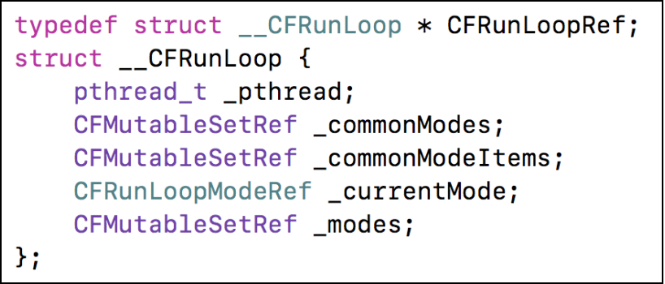

CFRunloopModeRef底层结构如下：
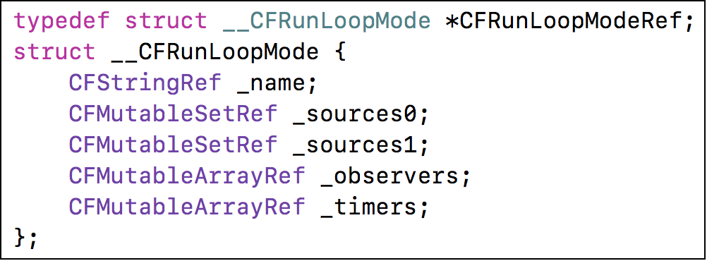

也就是说一个runloop里头有多个mode，每个mode又有多个source0 source1 timers observers 
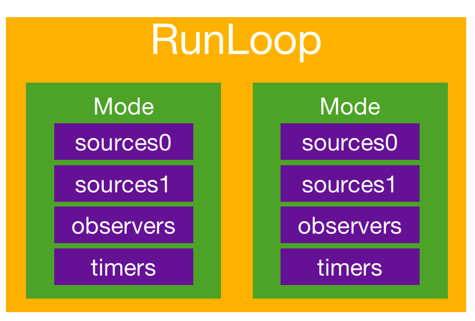

#### CFRunLoopModeRef
* CFRunLoopModeRef代表RunLoop的运行模式
* 一个RunLoop包含若干个Mode，每个Mode又包含若干个Source0/Source1/Timer/Observer
* RunLoop启动时只能选择其中一个Mode，作为currentMode
* 如果需要切换Mode，只能退出当前Loop，再重新选择一个Mode进入
	* 不同组的Source0/Source1/Timer/Observer能分隔开来，互不影响
* 如果Mode里没有任何Source0/Source1/Timer/Observer，RunLoop会立马退出
* 常见的2种Mode
	* kCFRunLoopDefaultMode（NSDefaultRunLoopMode）：App的默认Mode，通常主线程是在这个Mode下运行
	* UITrackingRunLoopMode：界面跟踪 Mode，用于 ScrollView 追踪触摸滑动，保证界面滑动时不受其他 Mode 影响

#### CFRunLoopObserverRef
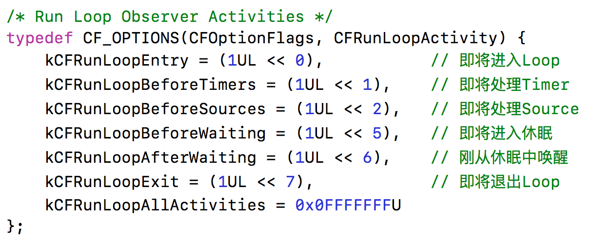

添加Observer监听RunLoop的所有状态
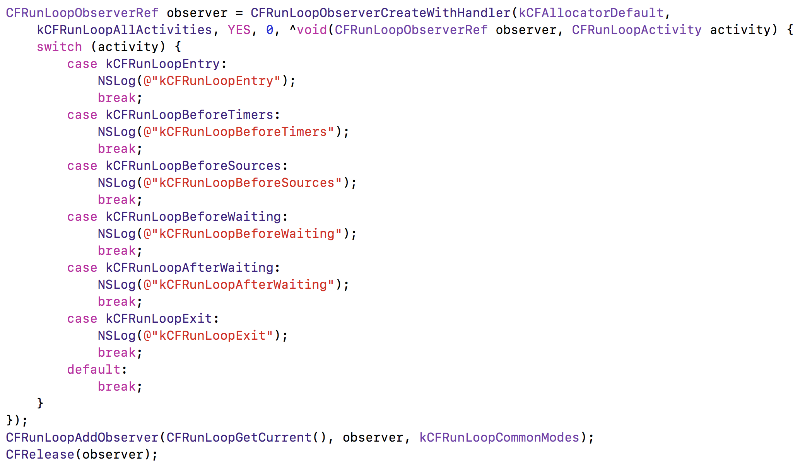

### RunLoop的运行逻辑
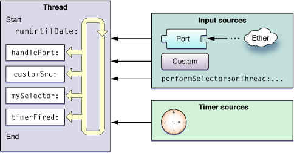

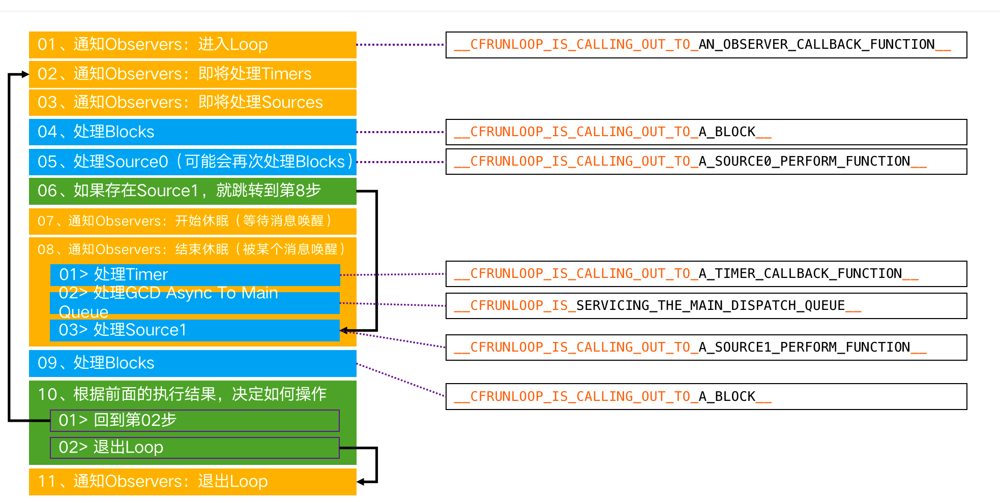

* Source0
	* 触摸事件处理
	* performSelector:onThread:

* Source1
	* 基于Port的线程间通信
	* 系统事件捕捉

* Timers
	* NSTimer
	* performSelector:withObject:afterDelay:

* Observers
	* 用于监听RunLoop的状态
	* UI刷新（BeforeWaiting）
	* Autorelease pool（BeforeWaiting）

运行逻辑如下：
* 01、通知Observers：进入Loop
* 02、通知Observers：即将处理Timers
* 03、通知Observers：即将处理Sources
* 04、处理Blocks
* 05、处理Source0（可能会再次处理Blocks）
* 06、如果存在Source1，就跳转到第8步
* 07、通知Observers：开始休眠（等待消息唤醒）
* 08、通知Observers：结束休眠（被某个消息唤醒）
	* 01> 处理Timer
	* 02> 处理GCD Async To Main Queue
	* 03> 处理Source1
* 09、处理Blocks
* 10、根据前面的执行结果，决定如何操作
	* 01> 回到第02步
	* 02> 退出Loop
* 11、通知Observers：退出Loop

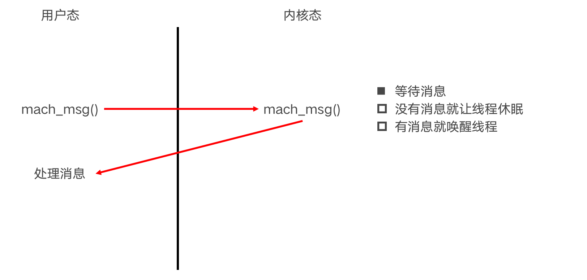

### RunLoop在实际开中的应用
* 控制线程生命周期（线程保活）
需要addPort，之后runMode，每次执行runMode后，如果当前没有被激活会自动进入睡眠，不会频繁while循环。
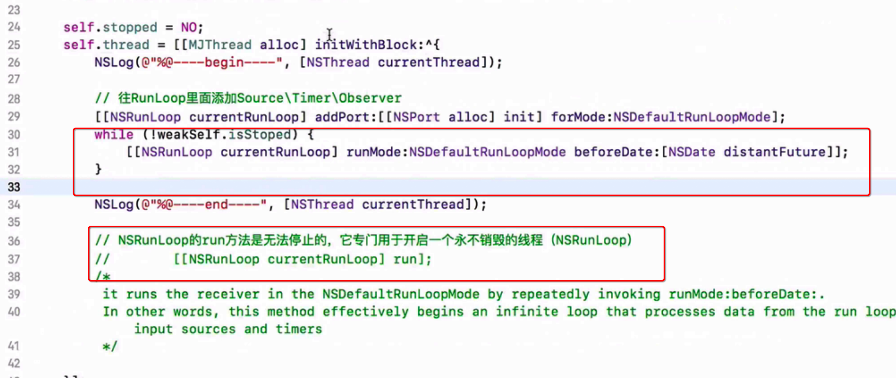

waituntilDone应该置位yes, 等待stop方法执行完再让Dealloc执行完。
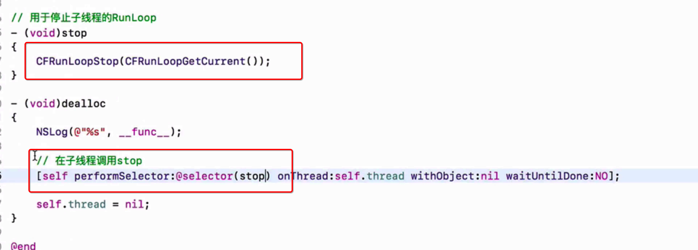

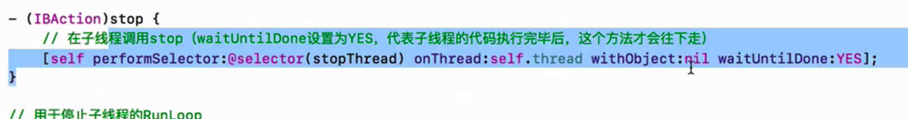

这里应该判断weakSelf，防止控制器释放了，weakSlef为nil了的情况
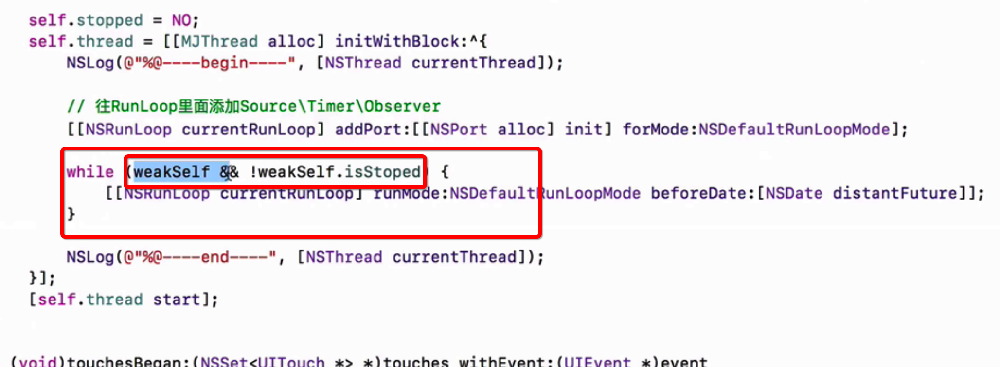

* 解决NSTimer在滑动时停止工作的问题
就是把timer加到commonMode上

* 监控应用卡顿
* 性能优化
