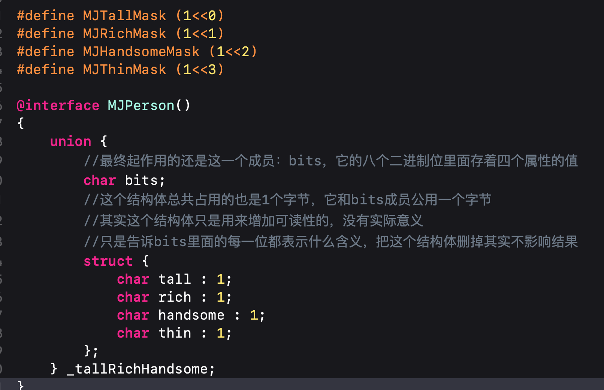
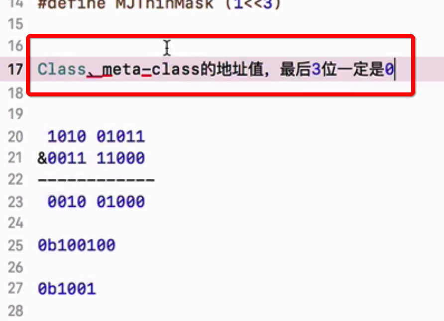

2020年10月5日  书店 天气不错，晴冷

## runtime 

### 按位与 按位或 
* 在arm64架构之前，isa就是一个普通的指针，存储着Class、Meta-Class对象的内存地址
* 从arm64架构开始，对isa进行了优化，变成了一个共用体（union）结构，还使用**位域**来存储更多的信息

先了解下C语言的基本知识
* 与运算& 
	* 两个同时为1，结果为1，否则为0
	* 比如 0000 1000 & 0000 1001 = 0000 1000
* 或运算|
	* 只要一个为1，其值为1。
	* 比如 0000 1000 | 0000 1001 = 0000 1001

* 取反运算~
	* 按位取反，0->1,1->0
	* ~0000 1000 = 1111 0111

* &常用来取值
	* 比如有二进制0001 1010，我想知道第四个二进制位是0还是1，那么我可以让这个数&上一个掩码0000 1000
	* 那么0001 1010 & 0000 1000 = 0000 1000，如果得到的数第四位为1那么远来得那个数第四位也一定为1，如果为0那么原来的那个数的第四位也是0。

* |常用来赋值
	* 比如有二进制数0001 1010，我想让他第一位变为1，那么可以让它|上一个掩码0000 0001
	* 那么0001 1010 | 0000 0001 = 0001 1011 
	* 这样既能保证不改变其他位的值，也能把第一位置位1.
	* 如果把第二位置0怎么办呢？先对掩码取反，再&
	* 也就是先取反 ~0000 0010 = 1111 1101
	* 然后再与 0001 1010 & 1111 1101 = 0001 1000

#### 对象的属性用& | 来赋值取值
加入此时我创建一个对象，这个对象有三个布尔类型的属性。正常情况下我们应该是这么创建的：

这样最终会占用三个字节，其实我们可以用一个字节就可以完成。

我们这样做：

我们只定义一个char类型的成员变量，它只占用一个字节，但我们怎么把三个属性用它表示呢？

这样做：

我们给成员变量用二进制赋值。三个属性的值分别用最低位的三个二进制位表示

那么我们就不需要属性了，我们改为如下的接口：

前面已经温习了C语言的知识，那下面就是取值和赋值的实现：

tall 属性

rich 属性

handsome属性

其中的宏是：

* 左移几位就是乘上2的几次方
* 右移几位就是除上2的几次方
* 前面讲取第一位就与上0000 0001 这就是 1<<0
* 前面讲取第二位就与上0000 0010 这就是 1<<1
* 前面讲取第三位就与上0000 0100 这就是 1<<2

至此三个属性只占用一个字节的demo就完成了：

#### 对象的属性用 & | 来赋值取值优化
我们对成员变量进行优化如下：

成员变量改为一个结构体变量_tallRichHandsome，结构体有三个成员，但每个成员规定了只占一位，且由上而下占用由低到高的二进制位，也就是说tall 占用第一个二进制位，rich占用第二个二进制位，handsome占用第三个二进制位。由于结构体的内存对齐原则，最终_tallRichHandsome还是只占用一个字节。

随之取值赋值改变如下：

赋值操作就按照常规操作正常赋值就能完事儿:

#### 对象的属性用 & | 来赋值取值再优化-共用体
来看下面：

这个是共用体结构，来存储我们的四个属性的值。最终也只需要1个字节，起作用的其实就只有bits成员。这个结构已经和isa_t共用体非常相似了：

demo中的共用体也等价于下面的：

也进一步等价于下面的：

 而且当使用共用体存储属性值时，其setter和getter方法的实现和只用一个char类型成员时的实现一模一样：
 
 
 至此位域大概就是这样了，下面仔细看下isa_t共用体
 
 ### isa_t共用体
  
  
  * 前面说过了在64位之后，isa指针指向的类对象或元类对象的地址需要做一次位运算才能拿到相应的地址
  * 64位之前isa指针指向的就直接是类对象地址或元类对象地址。
  
  
  从上图可以里看到占用33位的那个就是指向的类对象或元类对象地址，参与运算的掩码是：0xFFFFFFFF8：

    
 用计算器显示下二进制如下：
 
 
 中间的33位都是1，最低位的三位都是0，那么通过元&运算得到的地址最后三位一定都是0，也就是我们得到以下结论：

类对象或元类对象的地址最后三位永远都是0：

  